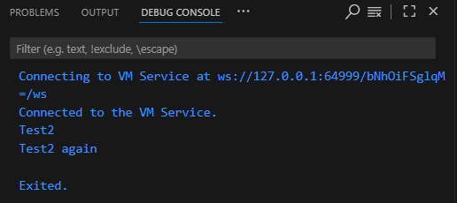
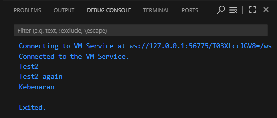
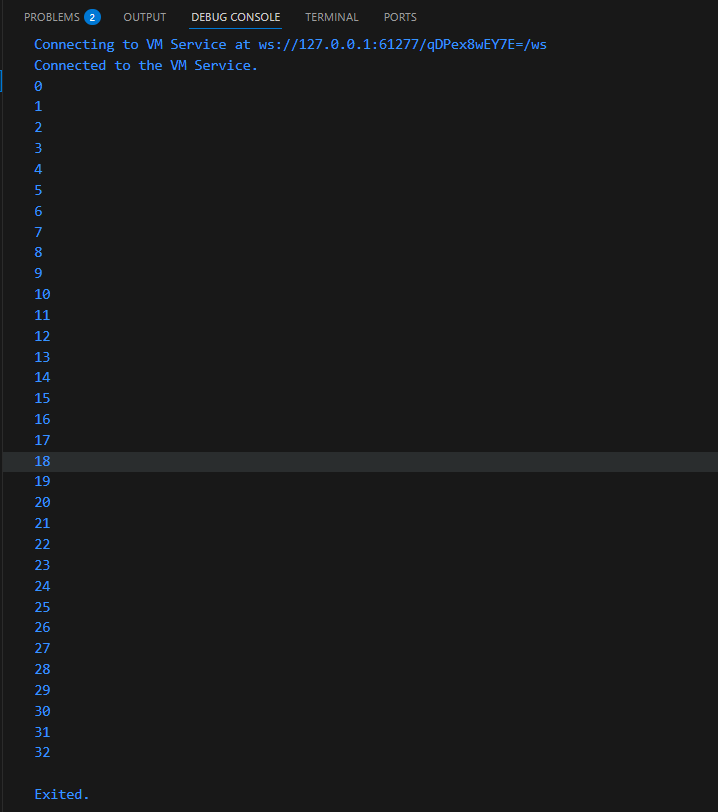
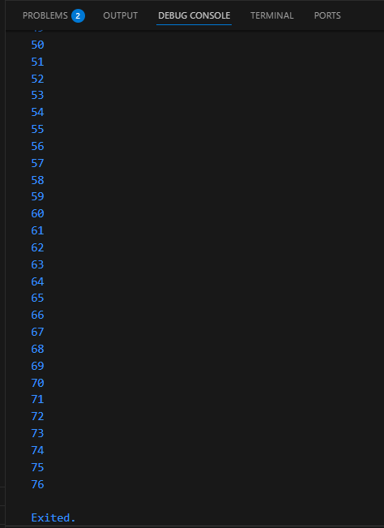
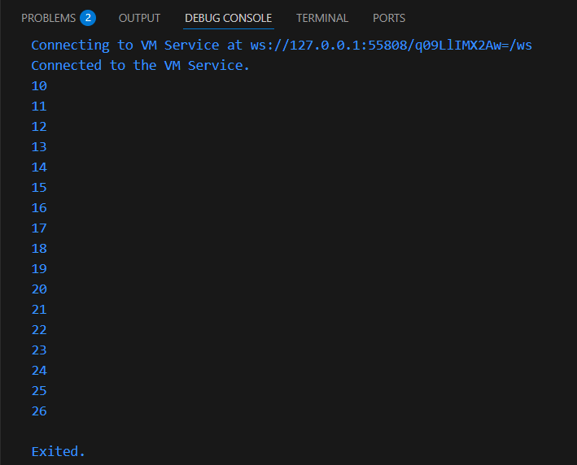
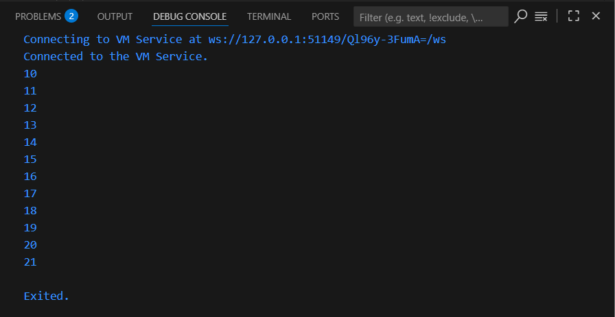
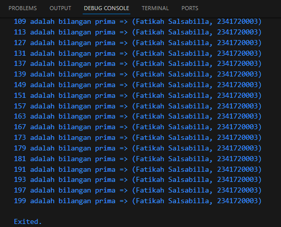

# Praktikum Week 3 

**Nama:** Fatikah Salsabilla  
**No Absen:** 14  
**Kelas:** 3H  

## Praktikum 1
2. kode program akan menghasilkanoutput "Test2" dan "Test2 again", karena pada percabangan pertama kondisi esle if terpenuhi maka menampilkan "Test2", kemudian percabangan kedua juga bernilai terpenuhi maka menampilkan "Test2 again"

3. Kode tersebut akan error karena deklarasi variabel "test" terdapat duplikat.Jadi, salah satu tipe data dalam deklarasi harus dihilangkan.

## Praktikum 2
2. Kode program akan error, karena tidak ada deklarasi variabel count.

3. Yang terjadi yaitu kode tersebut yang awalnya perhitungan hanya sampai 32, kemudian akan dilanjutkan perhitungan sampai angka 76.Jadi, kode program tersebut mencetak angka 0 - 76

## Praktikum 3
2. Kode program akan error, karena tidak ada deklarasi variabel dan pada variabel index terdapat penggunaan huruf i yang berbeda.

3.  Kode program tersebut menampilkan  angka 10 sampai 21, jika index sudah sampai angka 21 perulangan akan berhenti, jika index lebih dari 1 atau kurang dari 7 perulangan akan lanjut ke iterasi berikutnya. Sehingga, print kedua tidak akan dijalankan.

## Tugas Praktikum
3. 
