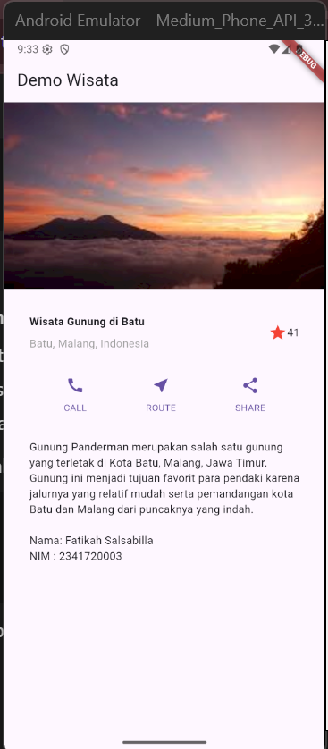
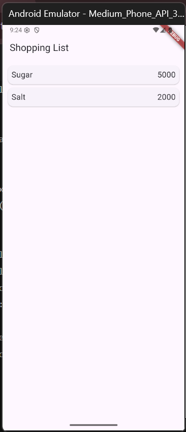
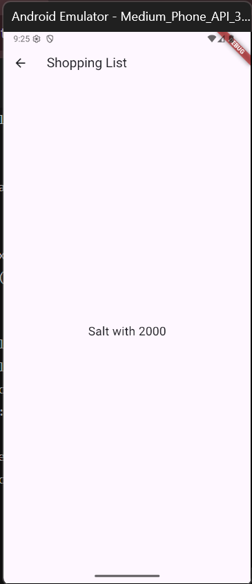
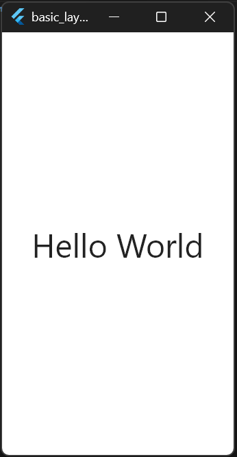
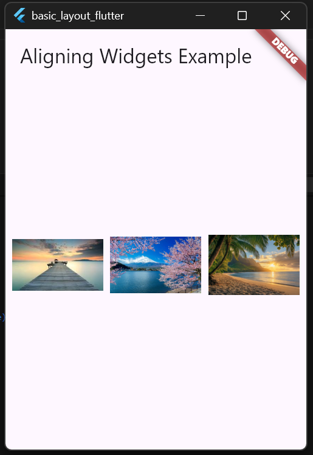
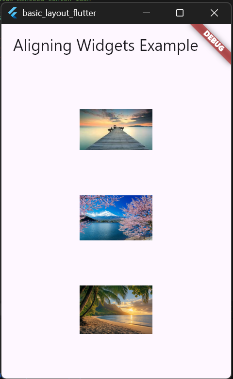
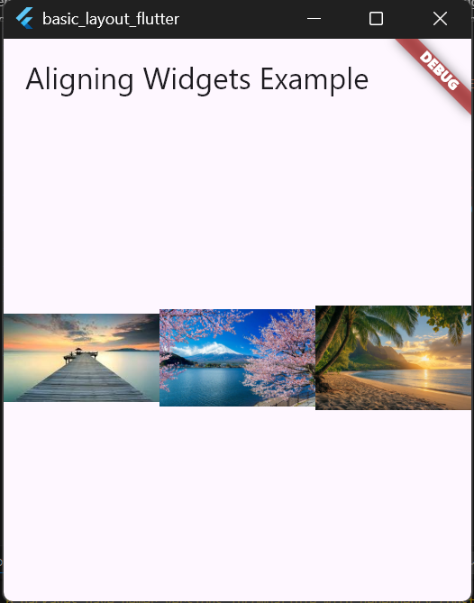
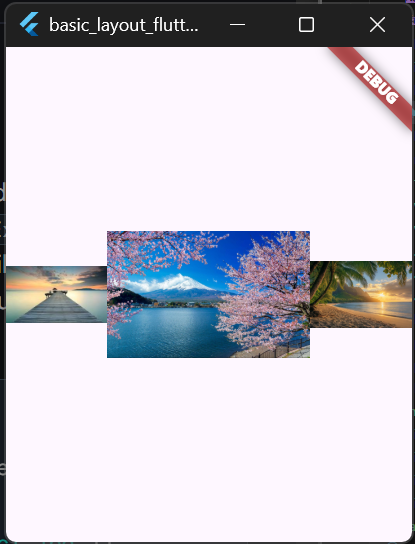
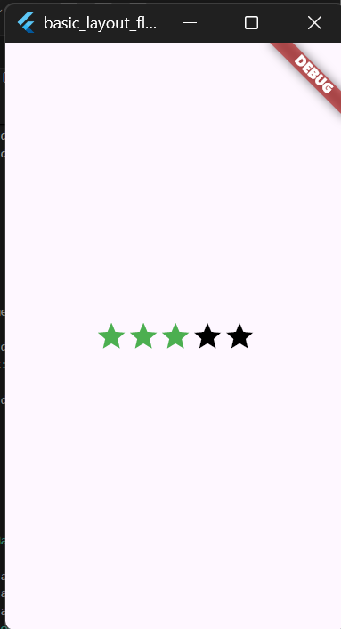
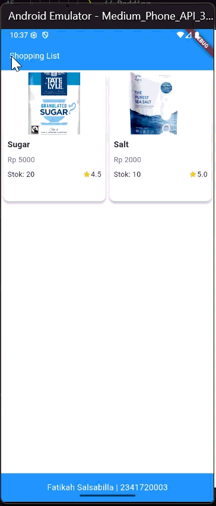

# Praktikum 1 - 4

# Praktikum 5




# Tugas Praktikum 1

## **Tata Letak Widget**



```dart
    import 'package:flutter/material.dart';

void main() {
  runApp(const MyApp());
}

class MyApp extends StatelessWidget {
  const MyApp({super.key});

  @override
  Widget build(BuildContext context) {
    return Container(
      decoration: const BoxDecoration(color: Colors.white),
      child: const Center(
        child: Text(
          'Hello World',
          textDirection: TextDirection.ltr,
          style: TextStyle(fontSize: 32, color: Colors.black87),
        ),
      ),
    );
  }
}
```

## **Menyelaraskan widget**



```dart
import 'package:flutter/material.dart';

void main() {
  runApp(const MyApp());
}

class MyApp extends StatelessWidget {
  const MyApp({super.key});

  @override
  Widget build(BuildContext context) {
    return MaterialApp(
      home: Scaffold(
        appBar: AppBar(title: const Text('Aligning Widgets Example')),
        body: Center(
          // Ganti Row dengan Column untuk mencoba contoh lain
          child: Row(
            mainAxisAlignment: MainAxisAlignment.spaceEvenly,
            children: [
              Image.asset('assets/pic1.jpeg', width: 100),
              Image.asset('assets/pic2.jpeg', width: 100),
              Image.asset('assets/pic3.jpg', width: 100),
            ],
          ),
        ),
      ),
    );
  }
}
```



```dart
import 'package:flutter/material.dart';

void main() {
  runApp(const MyApp());
}

class MyApp extends StatelessWidget {
  const MyApp({super.key});

  @override
  Widget build(BuildContext context) {
    return MaterialApp(
      home: Scaffold(
        appBar: AppBar(title: const Text('Aligning Widgets Example')),
        body: Center(
          // Ganti Row dengan Column untuk mencoba contoh lain
          child: Column(
            mainAxisAlignment: MainAxisAlignment.spaceEvenly,
            children: [
              Image.asset('assets/pic1.jpeg', width: 100),
              Image.asset('assets/pic2.jpeg', width: 100),
              Image.asset('assets/pic3.jpg', width: 100),
            ],
          ),
        ),
      ),
    );
  }
}
```

## **Ukuran Widget**



```dart
 child: Row(
            crossAxisAlignment: CrossAxisAlignment.center,
            children: [
              Expanded(child: Image.asset('assets/pic1.jpeg')),
              Expanded(child: Image.asset('assets/pic2.jpeg')),
              Expanded(child: Image.asset('assets/pic3.jpg')),
            ],
          ),
```



```dart
child: Row(
            crossAxisAlignment: CrossAxisAlignment.center,
            children: [
              Expanded(child: Image.asset('assets/pic1.jpeg')),
              Expanded(flex: 2, child: Image.asset('assets/pic2.jpeg')),
              Expanded(child: Image.asset('assets/pic3.jpg')),
            ],
          ),
```

## **Mengemas widget**



```dart
child: Row(
            mainAxisSize: MainAxisSize.min,
            children: [
              Icon(Icons.star, color: Colors.green[500]),
              Icon(Icons.star, color: Colors.green[500]),
              Icon(Icons.star, color: Colors.green[500]),
              const Icon(Icons.star, color: Colors.black),
              const Icon(Icons.star, color: Colors.black),
            ],
          ),
```

# Tugas Praktikum 2
