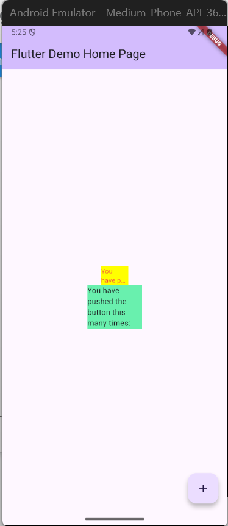

# Praktikum 7

### **Fatikah Salsabilla**
### **14 / 3H**

## Praktikum Menerapkan Plugin di Project Flutter
### Langkah 4 :

Terjadi error, karena widget AutoSizeText belum diimpor dan karena variabel text belum dideklarasikan didalam class 

### Langkah 5 :

## Tugas Praktikum
2. Plugin tersebut digunakan untuk menyesuaikan ukuran teks secara otomatis.
3. Untuk mendefinisikan variabel yang akan menyimpan teks yang ditampilkan.
4. - Container kuning : Menampilkan teks yang secara otomatis menyesuaikan ukuran font agar tetap muat di dalam lebar 50 piksel. 
    - container hijau : Menampilkan teks biasa tanpa penyesuaian ukuran.

5. - text untuk isi teks yang akan ditampilkan.	
    - style untuk menentukan tampilan teks seperti warna, - ukuran, font, ketebalan, dll.
    - maxLines untuk menentukan jumlah maksimum baris teks yang boleh ditampilkan.	
    - overflow untuk menentukan apa yang terjadi jika teks melebihi batas tampilan.