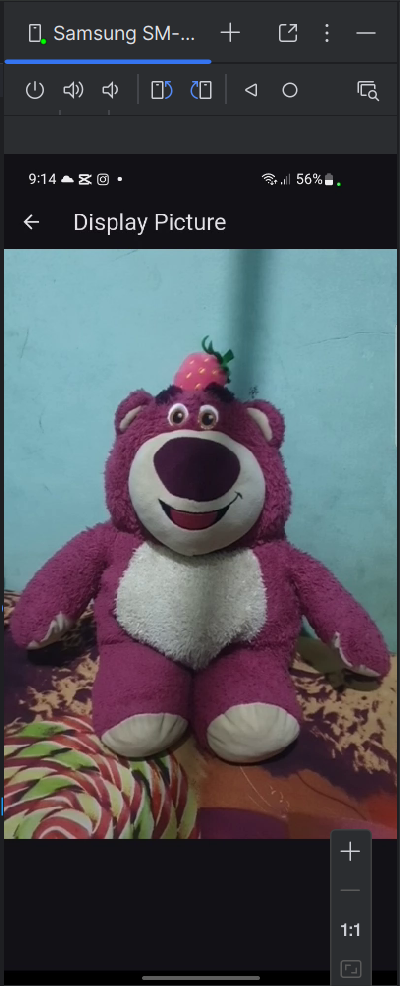

### Praktikum 1

pada hasil praktikum 1 yaitu bmembuat aplikasi pengambilan foto / input gambar
### Praktikum 2

pada hasil praktikum 2 yaitu Membuat filter carousel dengan menampilkan filter-filter yang bisa dipilih.
### Tugas Praktikum 
2. 
3. `void async`: fungsi asynchronous tanpa return value.
4.   - `@immutable`: semua property final, objek tidak berubah.   
     - `@override`: menimpa method superclass.