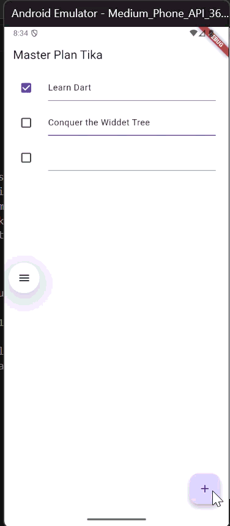
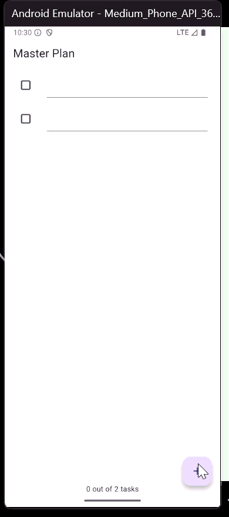
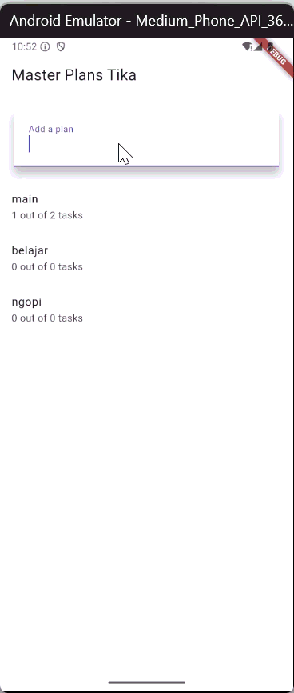
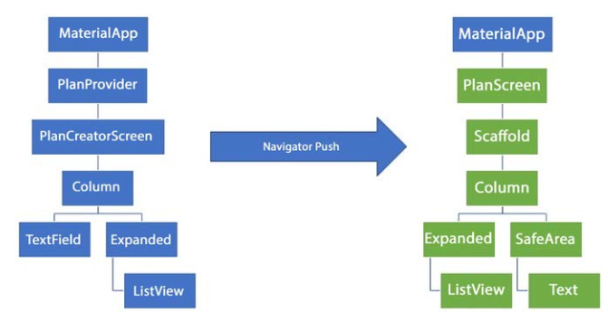

> **Nama :** Fatikah Salsabilla  
> **No. Absen :** 14  
> **Kelas :** TI - 3H

## Praktikum 1

## Tugas Praktikum 1
1. Selesaikan langkah-langkah praktikum tersebut, lalu dokumentasikan berupa GIF hasil akhir praktikum beserta penjelasannya di file README.md! Jika Anda menemukan ada yang error atau tidak berjalan dengan baik, silakan diperbaiki.
2. Jelaskan maksud dari langkah 4 pada praktikum tersebut! Mengapa dilakukan demikian?
    * Digunakan untuk menyederhanakan import model (plan.dart dan task.dart) agar cukup impor satu file saja.
3. Mengapa perlu variabel plan di langkah 6 pada praktikum tersebut? Mengapa dibuat konstanta ?
    * untuk menyimpan state utama berisi daftar tugas (tasks) dan nama rencana (name).
    * Dibuat const Plan() agar memiliki nilai awal tetap (kosong) dan efisien dalam memori.
4. Lakukan capture hasil dari Langkah 9 berupa GIF, kemudian jelaskan apa yang telah Anda buat!
5. Apa kegunaan method pada Langkah 11 dan 13 dalam lifecyle state ?
    * initState() → Inisialisasi ScrollController, menutup keyboard saat scroll.
    * dispose() → Membersihkan controller saat widget tidak digunakan lagi.
6. Kumpulkan laporan praktikum Anda berupa link commit atau repository GitHub ke dosen yang telah disepakati !

## Praktikum 2

## Tugas Praktikum 2
1. Selesaikan langkah-langkah praktikum tersebut, lalu dokumentasikan berupa GIF hasil akhir praktikum beserta penjelasannya di file README.md! Jika Anda menemukan ada yang error atau tidak berjalan dengan baik, silakan diperbaiki sesuai dengan tujuan aplikasi tersebut dibuat.
    * Aplikasi menampilkan daftar tugas yang bisa ditambah, diedit, dan diberi tanda selesai.
Progress tugas otomatis diperbarui tanpa setState() karena data dikelola melalui InheritedNotifier.

2. Jelaskan mana yang dimaksud InheritedWidget pada langkah 1 tersebut! Mengapa yang digunakan InheritedNotifier?
    * InheritedWidget digunakan untuk membagikan data ke widget lain.
    * InheritedNotifier dipakai karena selain membagikan data, juga dapat mendeteksi perubahan data dengan ValueNotifier, sehingga UI langsung ter-update.
3. Jelaskan maksud dari method di langkah 3 pada praktikum tersebut! Mengapa dilakukan demikian?
    * Method completedCount dan completenessMessage digunakan untuk menghitung jumlah tugas selesai dan menampilkan pesan progres.
4. Lakukan capture hasil dari Langkah 9 berupa GIF, kemudian jelaskan apa yang telah Anda buat!
    * Menampilkan daftar tugas dan teks progres di bawah layar.Setiap perubahan tugas otomatis memperbarui teks progres secara real-time.
5. Kumpulkan laporan praktikum Anda berupa link commit atau repository GitHub ke dosen yang telah disepakati !
## Praktikum 3

## Tugas Praktikum 3
1. Selesaikan langkah-langkah praktikum tersebut, lalu dokumentasikan berupa GIF hasil akhir praktikum beserta penjelasannya di file README.md! Jika Anda menemukan ada yang error atau tidak berjalan dengan baik, silakan diperbaiki sesuai dengan tujuan aplikasi tersebut dibuat.
    * Aplikasi jadi bisa menampung banyak rencana (Plan).
    Kita dapat menambah Plan baru, melihat daftar Plan, serta membuka tiap Plan untuk mengelola task-nya secara terpisah.Semua data dikelola dengan InheritedNotifier agar state tetap tersinkron antar layar.

2. Berdasarkan Praktikum 3 yang telah Anda lakukan, jelaskan maksud dari gambar diagram berikut ini!

    * Diagram menunjukkan aliran navigasi dan posisi state antar screen:
        - Sebelah kiri: PlanCreatorScreen digunakan untuk membuat Plan baru (input dengan TextField dan daftar Plan dalam ListView).
        - Sebelah kanan: PlanScreen menampilkan detail Plan (daftar tugas dengan progress di SafeArea).
        - Panah Navigator Push berarti saat user memilih satu Plan, aplikasi berpindah ke layar detail (PlanScreen), namun state Plan tetap dikelola oleh PlanProvider di atas kedua layar.state diletakkan di atas agar bisa digunakan oleh banyak screen.

3. Lakukan capture hasil dari Langkah 14 berupa GIF, kemudian jelaskan apa yang telah Anda buat!
    * Hasil akhirnya yaitu daftar Plan yang bisa ditambah lewat TextField.Setiap Plan menampilkan jumlah tugas yang sudah diselesaikan.Ketika salah satu Plan diklik, aplikasi berpindah ke halaman detail untuk menambah atau menandai tugas selesai.
    
4. Kumpulkan laporan praktikum Anda berupa link commit atau repository GitHub ke dosen yang telah disepakati !