## **Nama  : Fatikah Salsabilla**
## **No absen   : 14**
## **Kelas  : 3H / TI**

### Soal 1
* Tambahkan nama panggilan Anda pada **title** app sebagai identitas hasil pekerjaan Anda.
    ```dart
    return Scaffold(
        appBar: AppBar(
            title: const Text('Back from the Future Fatikah'),
        ),
    ```

### Soal 2
* Carilah judul buku favorit Anda di Google Books, lalu ganti ID buku pada variabel path di kode tersebut. Caranya ambil di URL browser Anda seperti gambar berikut ini.


* Kemudian cobalah akses di browser URI tersebut dengan lengkap seperti ini. Jika menampilkan data JSON, maka Anda telah berhasil. Lakukan capture milik Anda dan tulis di README pada laporan praktikum. Lalu lakukan commit dengan pesan "W11: Soal 2".

    - 
    ```dart
            Future<http.Response> getData() async {
        const authority = 'www.googleapis.com';
        const path = '/books/v1/volumes/WwPHEAAAQBAJ';
        final url = Uri.https(authority, path);
        return await http.get(url);
        }
    ```

### Soal 3
* Jelaskan maksud kode langkah 5 tersebut terkait substring dan catchError!
    - **substring**, digunakan untuk Membatasi teks hasil API agar tidak lebih dari 450 karakter dan mencegah error.
    - **catchError**, digunakan untuk Menangani error jika proses **getData()** gagal (misalnya jaringan bermasalah).

* Capture hasil praktikum Anda berupa GIF dan lampirkan di README. Lalu lakukan commit dengan pesan "W11: Soal 3".


### Soal 4
* Jelaskan maksud kode langkah 1 dan 2 tersebut!
    - Langkah 1
        Mendefinisikan tiga fungsi asynchronous (returnOneAsync, returnTwoAsync, returnThreeAsync) yang masing-masing menunggu 3 detik sebelum mengembalikan nilai 1, 2, dan 3 — digunakan untuk mensimulasikan proses yang butuh waktu
    - Langkah 2
        Fungsi count() memanggil ketiga fungsi tersebut secara berurutan dengan await, menjumlahkan hasilnya, lalu menggunakan setState() untuk menampilkan total ke UI.

* Capture hasil praktikum Anda berupa GIF dan lampirkan di README. Lalu lakukan commit dengan pesan "W11: Soal 4".
    - 

### Soal 5
* Jelaskan maksud kode langkah 2 tersebut!
    - Fungsi getNumber() membuat Completer, memanggil calculate(), lalu mengembalikan Future-nya.Setelah 5 detik di calculate(), completer.complete(42) menandakan Future selesai dan menghasilkan nilai 42.
* Capture hasil praktikum Anda berupa GIF dan lampirkan di README. Lalu lakukan commit dengan pesan "W11: Soal 5".


### Soal 6
* Jelaskan maksud perbedaan kode langkah 2 dengan langkah 5-6 tersebut!
    - Langkah 2 
        Future selalu sukses, tidak ada penanganan error.
    - Langkah 5-6
        Menambahkan try–catch untuk menangani error dan memanggil completeError().Tampilkan nilai jika sukses, atau pesan error jika gagal.

* Capture hasil praktikum Anda berupa GIF dan lampirkan di README. Lalu lakukan commit dengan pesan "W11: Soal 6".
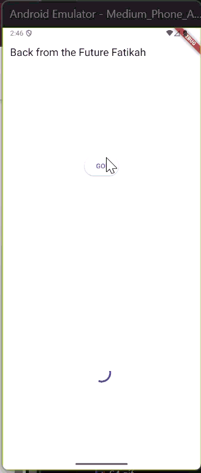

### Soal 7
* Capture hasil praktikum Anda berupa GIF dan lampirkan di README. Lalu lakukan commit dengan pesan "W11: Soal 7".
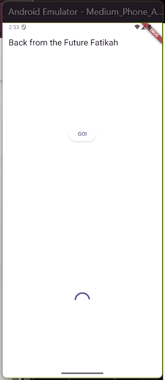

### Soal 8
* Jelaskan maksud perbedaan kode langkah 1 dan 4!
    - Langkah 1
        FutureGroup menambahkan beberapa Future satu per satu lalu menutupnya dengan close().
    - Langkah 4
        Future.wait langsung menjalankan semua Future dalam satu list sekaligus, lebih sederhana.

### Soal 9
* Capture hasil praktikum Anda berupa GIF dan lampirkan di README. Lalu lakukan commit dengan pesan "W11: Soal 9".
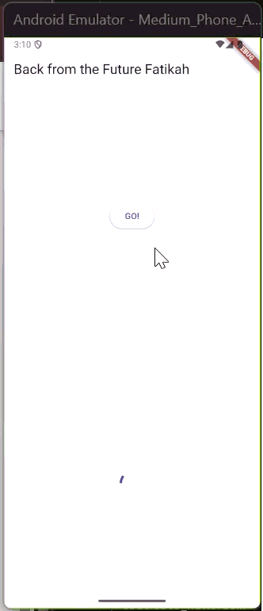

### Soal 10
* Panggil method handleError() tersebut di ElevatedButton, lalu run. Apa hasilnya? Jelaskan perbedaan kode langkah 1 dan 4!
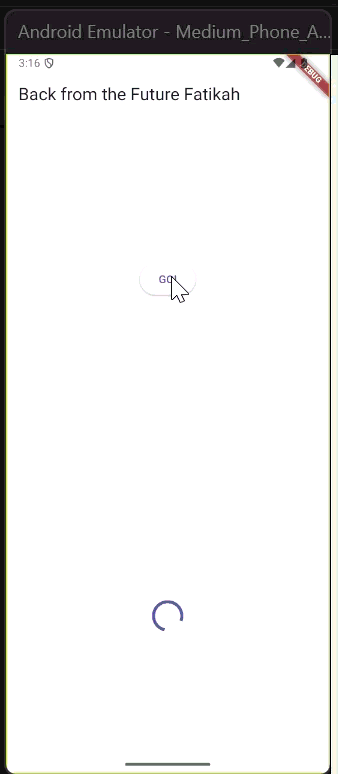
    - Langkah 1
        returnError hanya membuat fungsi async yang melempar error tanpa menanganinya.
    - Langkah 2
        handleError menambahkan blok try–catch–finally untuk menangkap error dari returnError,

### Soal 11
* Tambahkan nama panggilan Anda pada tiap properti title sebagai identitas pekerjaan Anda.

### Soal 12
* Jika Anda tidak melihat animasi loading tampil, kemungkinan itu berjalan sangat cepat. Tambahkan delay pada method getPosition() dengan kode await Future.delayed(const Duration(seconds: 3));
* Apakah Anda mendapatkan koordinat GPS ketika run di browser? Mengapa demikian?
    - Di browser, lokasi GPS tidak asli karena hanya menampilkan koordinat default Google (37.4219983, -122.084), bukan lokasi sebenarnya.
* Capture hasil praktikum Anda berupa GIF dan lampirkan di README. Lalu lakukan commit dengan pesan "W11: Soal 12".
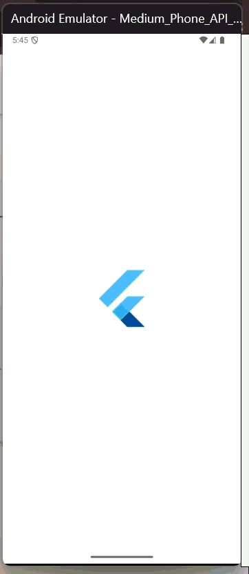

### Soal 13
* Apakah ada perbedaan UI dengan praktikum sebelumnya? Mengapa demikian?
    - Tampilan pada Praktikum 7 animasi loading nya tidak patah - patah, tidak ngelag
* Capture hasil praktikum Anda berupa GIF dan lampirkan di README. Lalu lakukan commit dengan pesan "W11: Soal 13".
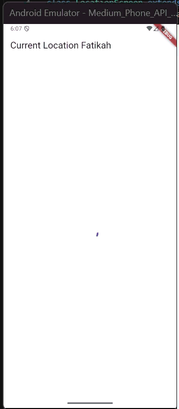
* Seperti yang Anda lihat, menggunakan FutureBuilder lebih efisien, clean, dan reactive dengan Future bersama UI.

### Soal 14
* Apakah ada perbedaan UI dengan langkah sebelumnya? Mengapa demikian?
    - Tidak da perbedaan yang terlihat
* Capture hasil praktikum Anda berupa GIF dan lampirkan di README. Lalu lakukan commit dengan pesan "W11: Soal 14".
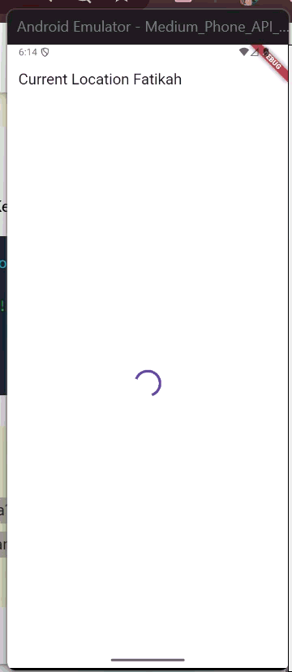

### Soal 15
* Tambahkan nama panggilan Anda pada tiap properti title sebagai identitas pekerjaan Anda.
* Silakan ganti dengan warna tema favorit Anda.

### Soal 16
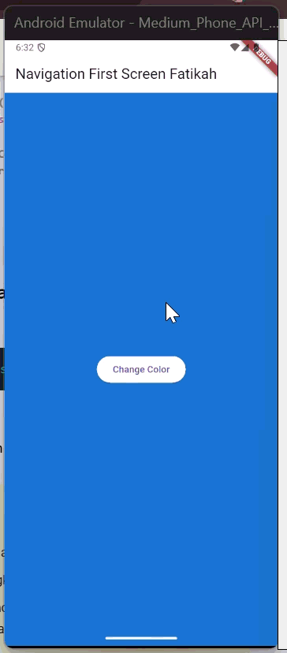
* Cobalah klik setiap button, apa yang terjadi ? Mengapa demikian ?
    - Tombol “Change Color” di NavigationFirst membuka NavigationSecond. Kemudian  memilih Red/Green/Blue mengirim warna balik lalu background layar pertama berubah sesuai pilihan, sedangkan jika kembali tanpa memilih, jatuh ke warna cadangan Colors.blue.
* Gantilah 3 warna pada langkah 5 dengan warna favorit Anda!
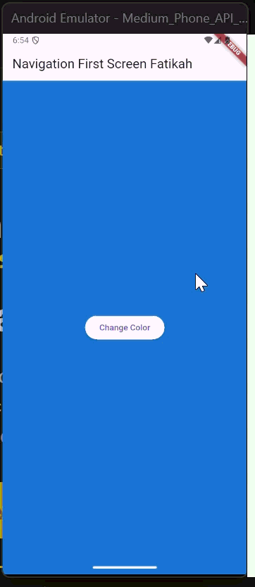
* Capture hasil praktikum Anda berupa GIF dan lampirkan di README. Lalu lakukan commit dengan pesan "W11: Soal 16".

### Soal 17
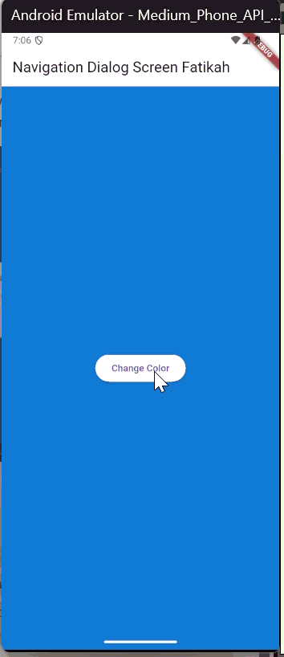
* Cobalah klik setiap button, apa yang terjadi ? Mengapa demikian ?
    - Menekan “Change Color” menampilkan dialog yang tidak bisa ditutup, saat memilih Navy/Tosca/Pink, dialog memanggil Navigator.pop dengan warna tersebut, showDialog mengembalikan nilai, lalu setState mengubah background Scaffold ke warna pilihan; jika menutup dialog dengan tombol back (tanpa memilih), hasilnya null sehingga warna tidak berubah.
* Gantilah 3 warna pada langkah 3 dengan warna favorit Anda!
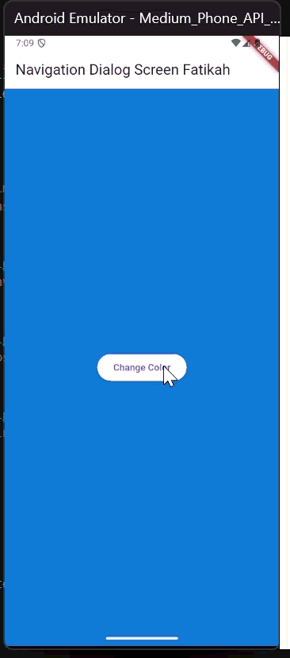
* Capture hasil praktikum Anda berupa GIF dan lampirkan di README. Lalu lakukan commit dengan pesan "W11: Soal 17".
