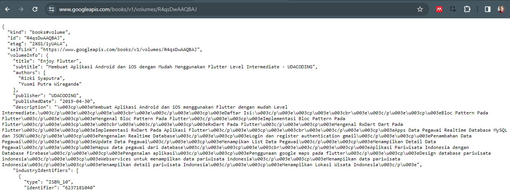
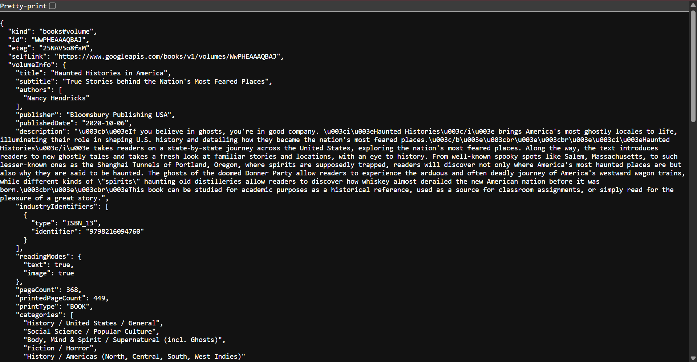
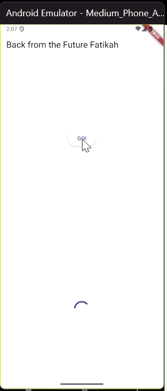
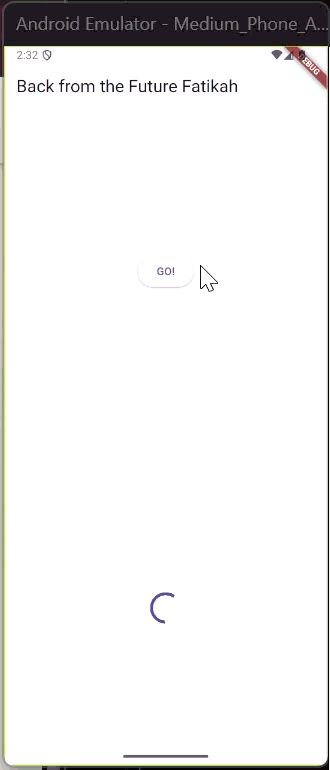

### Soal 1
* Tambahkan nama panggilan Anda pada **title** app sebagai identitas hasil pekerjaan Anda.
    ```dart
    return Scaffold(
        appBar: AppBar(
            title: const Text('Back from the Future Fatikah'),
        ),
    ```

### Soal 2
* Carilah judul buku favorit Anda di Google Books, lalu ganti ID buku pada variabel path di kode tersebut. Caranya ambil di URL browser Anda seperti gambar berikut ini.


* Kemudian cobalah akses di browser URI tersebut dengan lengkap seperti ini. Jika menampilkan data JSON, maka Anda telah berhasil. Lakukan capture milik Anda dan tulis di README pada laporan praktikum. Lalu lakukan commit dengan pesan "W11: Soal 2".

    - 
    ```dart
            Future<http.Response> getData() async {
        const authority = 'www.googleapis.com';
        const path = '/books/v1/volumes/WwPHEAAAQBAJ';
        final url = Uri.https(authority, path);
        return await http.get(url);
        }
    ```

### Soal 3

* Jelaskan maksud kode langkah 5 tersebut terkait substring dan catchError!
    - **substring**, digunakan untuk Membatasi teks hasil API agar tidak lebih dari 450 karakter dan mencegah error.
    - **catchError**, digunakan untuk Menangani error jika proses **getData()** gagal (misalnya jaringan bermasalah).

* Capture hasil praktikum Anda berupa GIF dan lampirkan di README. Lalu lakukan commit dengan pesan "W11: Soal 3".


### Soal 4
* Jelaskan maksud kode langkah 1 dan 2 tersebut!
    - Langkah 1
        Mendefinisikan tiga fungsi asynchronous (returnOneAsync, returnTwoAsync, returnThreeAsync) yang masing-masing menunggu 3 detik sebelum mengembalikan nilai 1, 2, dan 3 — digunakan untuk mensimulasikan proses yang butuh waktu
    - Langkah 2
        Fungsi count() memanggil ketiga fungsi tersebut secara berurutan dengan await, menjumlahkan hasilnya, lalu menggunakan setState() untuk menampilkan total ke UI.

* Capture hasil praktikum Anda berupa GIF dan lampirkan di README. Lalu lakukan commit dengan pesan "W11: Soal 4".
    - 

### Soal 5
* Jelaskan maksud kode langkah 2 tersebut!
    - Fungsi getNumber() membuat Completer, memanggil calculate(), lalu mengembalikan Future-nya.Setelah 5 detik di calculate(), completer.complete(42) menandakan Future selesai dan menghasilkan nilai 42.
* Capture hasil praktikum Anda berupa GIF dan lampirkan di README. Lalu lakukan commit dengan pesan "W11: Soal 5".

