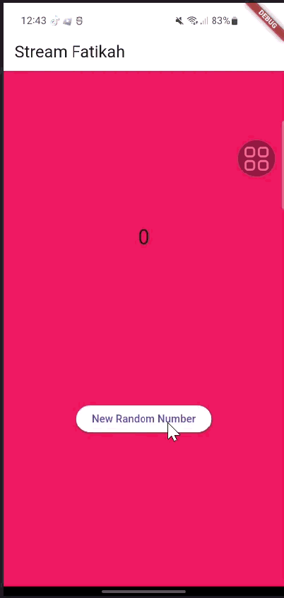

## Soal 1
* Tambahkan nama panggilan Anda pada title app sebagai identitas hasil pekerjaan Anda.
    ```dart
    return MaterialApp(
        title: 'Stream Fatikah',
        theme: ThemeData(primarySwatch: Colors.pink),
        home: const StreamHomePage(),
        );
    ```
* Gantilah warna tema aplikasi sesuai kesukaan Anda.
* Lakukan commit hasil jawaban Soal 1 dengan pesan "W12: Jawaban Soal 1"

## Soal 2
* Tambahkan 5 warna lainnya sesuai keinginan Anda pada variabel colors tersebut.
    ```dart
    Colors.indigo,
    Colors.cyan,
    Colors.lime,
    Colors.pink,
    Colors.orange,
    ```
* Lakukan commit hasil jawaban Soal 2 dengan pesan "W12: Jawaban Soal 2"

## Soal 3
* Jelaskan fungsi keyword yield* pada kode tersebut!
    * Untuk meneruskan semua nilai dari stream lain ke stream yang sedang dibuat.
* Apa maksud isi perintah kode tersebut?
    * Kode tersebut membuat stream yang mengeluarkan warna baru setiap 1 detik, dan warna diambil secara berulang dari daftar colors.
* Lakukan commit hasil jawaban Soal 3 dengan pesan "W12: Jawaban Soal 3"

## Soal 4
* Capture hasil praktikum Anda berupa GIF dan lampirkan di README.

* Lakukan commit hasil jawaban Soal 4 dengan pesan "W12: Jawaban Soal 4"

## Soal 5
* Jelaskan perbedaan menggunakan listen dan await for (langkah 9) !
    * listen() → langsung menerima dan menangani data stream saat muncul.
    * await for → membaca data stream satu per satu sambil menunggu data berikutnya.
* Lakukan commit hasil jawaban Soal 5 dengan pesan "W12: Jawaban Soal 5"


## Soal 6
* Jelaskan maksud kode langkah 8 dan 10 tersebut!
    * Langkah 8: Menyiapkan stream dan mulai mendengarkan datanya. Setiap ada data baru dari stream, UI akan diperbarui.
    * Langkah 10: Menghasilkan angka acak dan mengirimkan angka tersebut ke stream supaya listener di langkah 8 bisa menerima dan menampilkan angka baru.
* Capture hasil praktikum Anda berupa GIF dan lampirkan di README.

* Lalu lakukan commit dengan pesan "W12: Jawaban Soal 6".