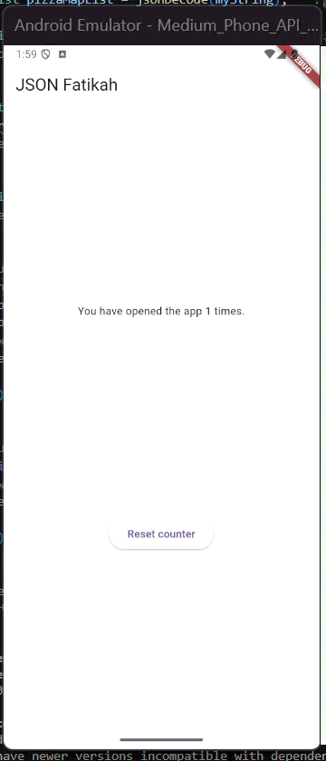
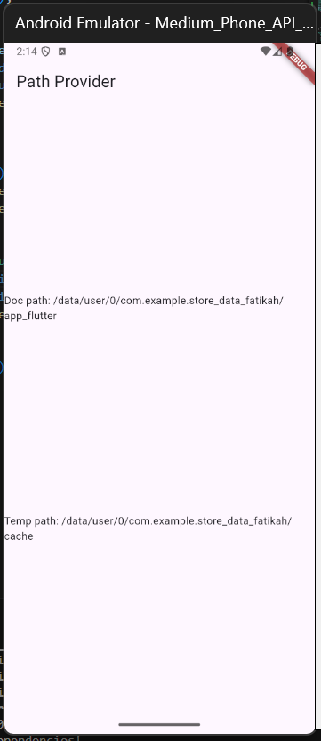
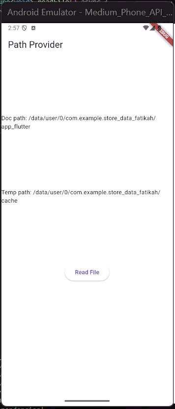
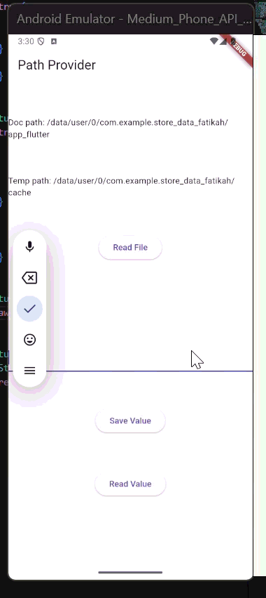

## Soal 2

## Soal 3

## Soal 4

## Soal 5

* Safe: Mencegah error jika data kosong atau format berubah.
* Maintainable: Mudah diperbarui karena struktur data terpusat dan rapi.
## Soal 6

## Soal 7

## Soal 8

* writeFile()	Menulis / menyimpan data ke file
* readFile()	Membaca isi file dan menampilkannya ke layar
## Soal 9
