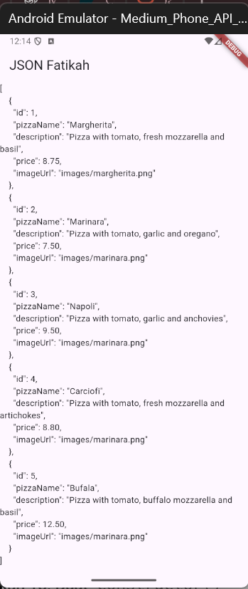
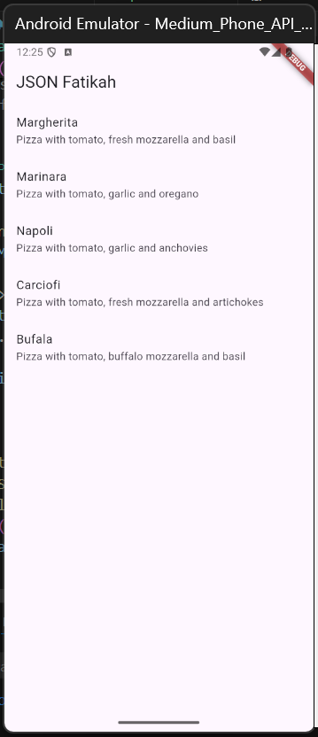
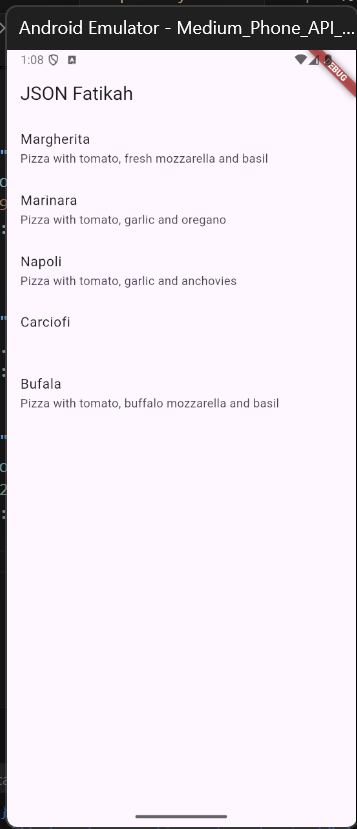
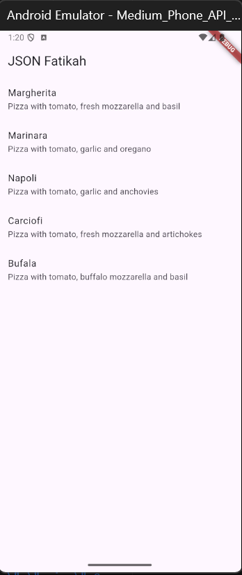

## Soal 2

## Soal 3

## Soal 4

## Soal 5

* Safe: Mencegah error jika data kosong atau format berubah.
* Maintainable: Mudah diperbarui karena struktur data terpusat dan rapi.
## Soal 6
## Soal 7
## Soal 8
## Soal 9