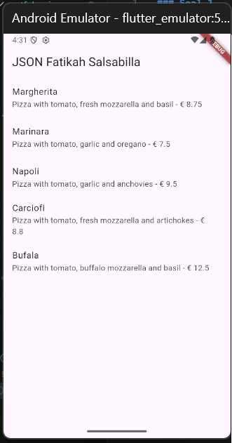
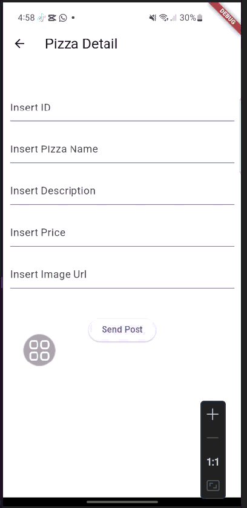
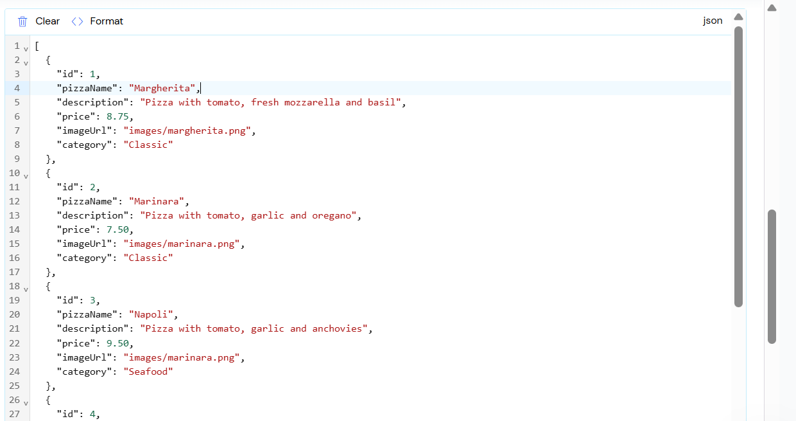
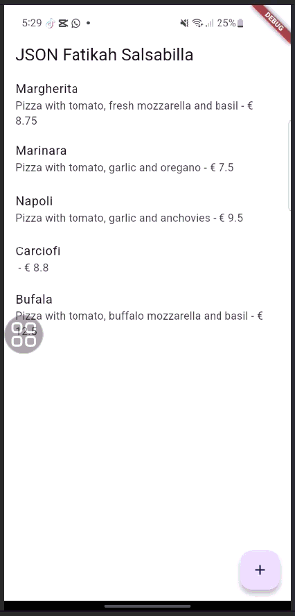

### Soal 1



### Soal 2



* Tambahkan field baru dalam JSON maupun POST ke Wiremock!
    - **JSON**
    ```dart
        [
  {
    "id": 1,
    "pizzaName": "Margherita",
    "description": "Pizza with tomato, fresh mozzarella and basil",
    "price": 8.75,
    "imageUrl": "images/margherita.png",
    "category": "Classic"
  },
  {
    "id": 2,
    "pizzaName": "Marinara",
    "description": "Pizza with tomato, garlic and oregano",
    "price": 7.50,
    "imageUrl": "images/marinara.png",
    "category": "Classic"
  },
  {
    "id": 3,
    "pizzaName": "Napoli",
    "description": "Pizza with tomato, garlic and anchovies",
    "price": 9.50,
    "imageUrl": "images/marinara.png",
    "category": "Seafood"
  },
  {
    "id": 4,
    "pizzaName": "Carciofi",
    "price": 8.80,
    "imageUrl": "images/marinara.png",
    "category": "Vegetarian"
  },
  {
    "pizzaName": "Bufala",
    "description": "Pizza with tomato, buffalo mozzarella and basil",
    "price": 12.50,
    "imageUrl": "images/marinara.png",
    "category": "Premium"
  }] 
    ```
 - Wiremock
 


- **Hasil**



### Soal 3
### Soal 4
